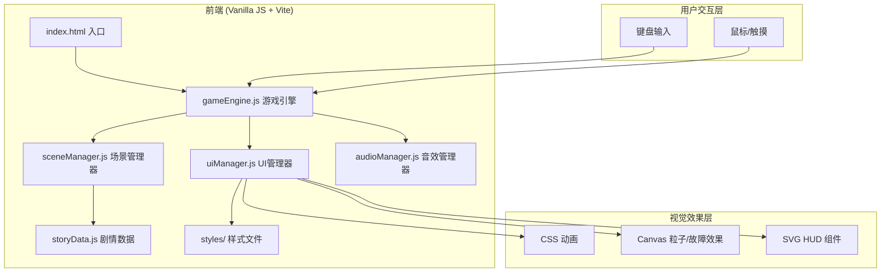

# 地球Online - 技术架构文档

## 1. 架构设计



## 2. 技术描述

- **前端框架**：原生 JavaScript (ES6+)，不引入重型框架，保持轻量和沉浸式体验
- **构建工具**：Vite 5.x（快速开发，原生ESM）
- **样式方案**：原生 CSS + CSS Variables + CSS Animations
- **视觉特效**：Canvas 2D（故障效果、扫描线、粒子）+ CSS 动画
- **音效方案**：Web Audio API（程序化生成音效，无需音频文件）
- **字体**：Google Fonts（Share Tech Mono + Noto Sans SC）

### 技术选型理由
1. **无框架依赖**：互动叙事体验重在视觉和氛围，原生JS足够，减少加载体积
2. **Canvas 特效**：故障艺术、扫描线等效果用 Canvas 实现性能最优
3. **Web Audio**：程序化生成8-bit风格音效，零资源依赖，契合末日科技感
4. **Vite**：开发体验好，构建产物优化

## 3. 模块设计

### 3.1 目录结构

```
earth-online/
├── index.html              # 主入口HTML
├── package.json
├── vite.config.js
├── public/
│   └── favicon.svg
├── src/
│   ├── main.js             # 入口文件，初始化游戏
│   ├── game/
│   │   ├── GameEngine.js   # 游戏引擎核心
│   │   ├── SceneManager.js # 场景/剧情管理
│   │   ├── StateManager.js # 状态管理（生存点、选择历史等）
│   │   └── InputManager.js # 输入处理
│   ├── ui/
│   │   ├── HUD.js          # 顶部HUD（生存点、日期）
│   │   ├── ChoicePanel.js  # 选择面板
│   │   ├── DialogBox.js    # 对话框
│   │   ├── BraceletUI.js   # 手环装饰UI
│   │   ├── StartScreen.js  # 启动页
│   │   └── EndingScreen.js # 结局页
│   ├── effects/
│   │   ├── GlitchEffect.js   # 故障效果
│   │   ├── Scanlines.js      # 扫描线
│   │   └── ParticleSystem.js # 粒子系统
│   ├── audio/
│   │   └── AudioManager.js # 音效管理（Web Audio API）
│   ├── data/
│   │   └── story.js        # 剧情数据（场景、选择、分支）
│   └── styles/
│       ├── main.css        # 主样式
│       ├── variables.css   # CSS变量（颜色、尺寸）
│       ├── animations.css  # 关键帧动画
│       └── responsive.css  # 响应式
```

### 3.2 核心模块职责

| 模块 | 职责 |
|------|------|
| GameEngine | 游戏主循环，协调各模块，控制游戏流程 |
| SceneManager | 管理场景切换，根据选择推进剧情 |
| StateManager | 存储游戏状态：生存点、选择历史、当前章节、统计数据 |
| HUD | 渲染顶部状态栏：生存点数值、日期、区域名、警告效果 |
| ChoicePanel | 渲染选择按钮，处理选择交互，倒计时逻辑 |
| DialogBox | 打字机效果显示对话/叙述文本 |
| GlitchEffect | Canvas 实现的故障闪烁、色彩分离效果 |
| AudioManager | 用 Web Audio 生成各种音效（蜂鸣、电流、按键等）|

## 4. 数据结构设计

### 4.1 剧情节点数据结构

```javascript
// story.js - 剧情节点定义
const storyNodes = {
  "start": {
    id: "start",
    type: "narrative", // narrative / choice / ending
    background: "ruins-street", // 场景背景标识
    text: "坍塌三年后，你行走在废墟街道上...",
    character: null, // 说话角色名
    next: "choice_1", // 下一个节点（自动跳转）
    duration: 3000, // 自动跳转延迟
  },
  "choice_1": {
    id: "choice_1",
    type: "choice",
    background: "ruins-street",
    text: "一个衣衫褴褛的老人拦住了你，他伸出颤抖的手...",
    character: null,
    choices: [
      {
        id: "a",
        text: "给他一份压缩饼干 (-20生存点)",
        cost: -20,
        next: "help_old_man",
        consequence: "善举"
      },
      {
        id: "b",
        text: "推开他，继续赶路",
        cost: 0,
        next: "ignore_old_man",
        consequence: "冷漠"
      }
    ],
    timeout: 15000, // 选择超时时间（毫秒），0为不限时
    timeoutChoice: "b" // 超时默认选择
  },
  "ending_awake": {
    id: "ending_awake",
    type: "ending",
    endingType: "good", // good / bad / neutral / death
    title: "结局A：觉醒者",
    text: "你揭开了伊甸公司的真相，加入了反抗军...",
    stats: { /* 统计数据 */ }
  }
}
```

### 4.2 游戏状态数据结构

```javascript
// StateManager 内部状态
{
  survivalPoints: 120.00,    // 当前生存点
  currentNodeId: "start",    // 当前剧情节点
  choiceHistory: [],         // 选择历史 [{nodeId, choiceId, timestamp}]
  dayCount: 1,               // 存活天数
  totalChoices: 0,           // 总选择次数
  totalPointsEarned: 0,      // 累计获得生存点
  totalPointsSpent: 0,       // 累计消耗生存点
  unlockedEndings: [],       // 已解锁结局
  isWarning: false,          // 是否处于警告状态
  gamePhase: "start"         // start / playing / ending
}
```

## 5. CSS 变量设计

```css
:root {
  /* 主色调 */
  --color-bg: #0a0a0a;
  --color-surface: #141414;
  --color-border: #2a2a2a;
  
  /* 警告/生存点红 */
  --color-danger: #ff2a2a;
  --color-danger-glow: rgba(255, 42, 42, 0.6);
  
  /* 数据绿 */
  --color-data: #00ff88;
  --color-data-dim: #00aa55;
  
  /* 警告橙 */
  --color-warning: #ff8c00;
  
  /* 铁锈色 */
  --color-rust: #8b4513;
  
  /* 文字 */
  --color-text: #e0e0e0;
  --color-text-dim: #888;
  --color-text-muted: #555;
  
  /* 字体 */
  --font-mono: 'Share Tech Mono', monospace;
  --font-sans: 'Noto Sans SC', sans-serif;
  --font-marker: 'Permanent Marker', cursive;
  
  /* 尺寸 */
  --hud-height: 60px;
  --choice-panel-height: 200px;
  
  /* 动画 */
  --glitch-duration: 0.3s;
  --warning-pulse: 1s;
}
```

## 6. 关键交互流程

### 6.1 场景切换流程
```
玩家选择 → 触发选择事件 → StateManager更新状态（增减生存点）
→ 播放故障转场特效 → SceneManager加载下一场景 → DialogBox打字机显示文本
→ 如有选择 → ChoicePanel渲染选项
```

### 6.2 生存点警告机制
```
生存点 <= 50 → 黄色脉冲警告
生存点 <= 20 → 红色快速闪烁 + 蜂鸣声
生存点 <= 0.01 → 触发死亡结局（归零者）
```

## 7. 性能优化

- **Canvas 特效分层**：静态扫描线用 CSS，动态故障用 Canvas，按需启用
- **DOM 最小化**：UI 元素复用，避免频繁创建/销毁
- **requestAnimationFrame**：所有动画统一 RAF 调度
- **音效懒初始化**：首次交互后才初始化 AudioContext（浏览器策略）
- **CSS 变量驱动**：主题切换用 CSS 变量，性能最优

## 8. 浏览器兼容

- 使用 `@supports` 检测 CSS feature support
- Canvas 2D 降级方案（自动关闭特效）
- 触控设备自动适配按钮尺寸
