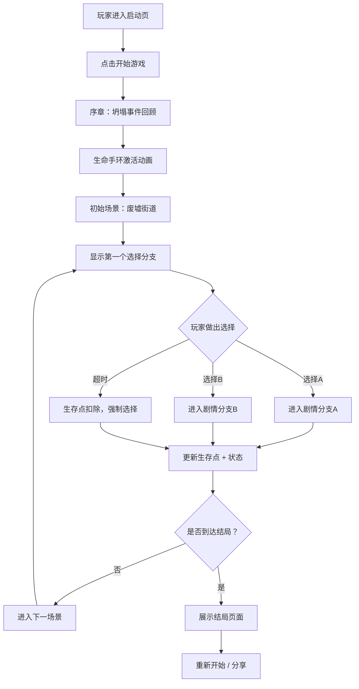

# 地球Online - 互动视频体验页面 产品需求文档

## 1. 产品概述

### 项目名称
**地球Online (Earth Online)** - 末日生存沉浸式互动视频体验

### 核心价值
基于"坍塌"末日世界观，打造一个沉浸式第一人称互动视频体验。玩家通过佩戴生命手环的视角，在废土世界中做出关键抉择，体验生存点系统带来的紧张感与道德困境。

### 目标用户
- 互动叙事/电影游戏爱好者
- 末日题材粉丝
- 短篇互动故事体验者
- 沉浸式网页体验探索者

## 2. 核心功能

### 2.1 用户角色
| 角色 | 进入方式 | 核心权限 |
|------|----------|----------|
| 玩家 | 直接进入，无需注册 | 体验完整互动剧情，查看生存状态，做出剧情选择 |

### 2.2 功能模块

1. **开场序章**：灾难背景介绍 + 生命手环激活仪式
2. **主剧情体验**：分支剧情视频/场景展示 + 选择交互
3. **生存状态HUD**：实时显示生存点、手环状态、时间
4. **任务系统**：高危任务接取与完成反馈
5. **结局系统**：多结局收束 + 统计回顾

### 2.3 页面详情

| 页面名称 | 模块名称 | 功能描述 |
|----------|----------|----------|
| 启动页 | 标题动画 | 故障艺术风格标题，"启动"按钮，背景音效提示 |
| 序章场景 | 背景叙事 | 坍塌事件回顾，伊甸公司介绍，生命手环激活动画 |
| 主游戏界面 | 视频/场景展示区 | 场景画面、角色对话、氛围效果 |
| 主游戏界面 | 生存HUD | 生存点数、手环状态条、日期显示、警告闪烁效果 |
| 主游戏界面 | 选择交互区 | 2-4个剧情选项按钮，悬停/点击特效，倒计时压力 |
| 主游戏界面 | 任务面板 | 当前任务描述、奖励生存点、危险等级 |
| 结局页面 | 结局展示 | 结局标题、结局描述、总生存点、关键选择回顾 |
| 结局页面 | 重玩选项 | 重新开始、选择章节、分享结果 |

## 3. 核心流程

## 4. 用户界面设计

### 4.1 设计风格
- **主色调**：深黑/炭灰底色 + 荧光红警告色 + 暗绿数据色 + 铁锈橙点缀
- **整体风格**：末日废土 + 赛博故障艺术 + HUD界面科技感
- **按钮风格**：粗糙边框 + 故障闪烁 + 按下时的电流扰动效果
- **字体选择**：
  - 标题/数字：Share Tech Mono（等宽科技感）
  - 正文：Noto Sans SC（清晰易读）
  - 特殊文字：Permanent Marker（手写涂鸦风，用于废土标语）
- **布局风格**：全屏沉浸式 + 边缘HUD信息 + 底部选择区
- **视觉特效**：
  - 扫描线叠加（模拟老旧屏幕）
  - 随机故障闪烁（手环不稳定时）
  - CRT显示器弯曲效果
  - 胶片颗粒噪点
  - 红光警告脉冲

### 4.2 页面设计概览

| 页面名称 | 模块名称 | UI元素 |
|----------|----------|--------|
| 启动页 | 标题区 | 故障动画标题"地球Online"、副标题"坍塌三年后"、红色发光按钮"启动" |
| 序章场景 | 叙事区 | 黑白历史影像风格文字、逐行打字效果、伊甸公司LOGO动画 |
| 主游戏界面 | 场景展示区 | 全屏场景背景、前景对话文本、角色名字标签 |
| 主游戏界面 | 顶部HUD | 左侧：生存点数字（红色发光）、右侧：日期/区域名 |
| 主游戏界面 | 底部选择区 | 2-4个选项卡片、悬停时边框发光、点击后全屏故障切换 |
| 主游戏界面 | 手环装饰 | 左下角/右下角：生命手环虚拟UI扫描动画 |
| 结局页面 | 结局展示 | 大标题结局名、故事收束文字、统计数据（总生存点、选择次数、存活天数）|

### 4.3 响应式
- **桌面端**：全屏沉浸式体验，16:9 优先
- **平板/移动端**：自适应缩放，保持核心HUD和选择区域可读性
- **触摸优化**：选择按钮最小高度 56px，间距充足

### 4.4 音效与动效（Web Audio）
- 启动：电流接通声 + 手环滴滴声
- 生存点变化：上升/下降的电子音效
- 警告：急促的蜂鸣声
- 选择点击：机械按键声 + 故障噪声
- 背景氛围：低频环境音（风声、远处机械声）

## 5. 剧情分支设计（核心内容）

### 5.1 故事主线
玩家扮演一名普通幸存者，手环初始生存点：**120.00**。在废墟城市中生存，通过完成任务赚取生存点，同时揭开伊甸公司和"地球Online"系统的真相。

### 5.2 关键分支节点
| 章节 | 场景 | 选择 | 后果 |
|------|------|------|------|
| 第一章 | 废墟街道，遇到乞讨老人 | A. 给予食物 (-20点) / B. 无视走开 | A: 获得信息线索 / B: 生存点充足但良心谴责 |
| 第一章 | 任务公告板 | A. 物资搜索任务(低危) / B. 电网维修任务(高危) | A: +30点 / B: +150点但有失败风险 |
| 第二章 | 黑市交易区 | A. 购买药品 / B. 购买情报 | 不同剧情分支 |
| 终章 | 伊甸大厦 | 多个结局分支 | 反抗 / 服从 / 逃离 / 真相 |

### 5.3 结局设计
- **结局A：觉醒者** - 揭露系统真相，加入反抗军
- **结局B：顺从者** - 累积1000万点，兑换"永生"
- **结局C：逃亡者** - 逃离系统，在荒野求生
- **结局D：归零者** - 生存点耗尽，毒发身亡（死亡结局）

## 6. 非功能需求

### 6.1 性能要求
- 首屏加载 < 2秒
- 场景切换流畅 < 300ms
- 动画帧率 ≥ 60fps

### 6.2 兼容性
- Chrome / Safari / Firefox 最新版
- iOS 14+ / Android 10+
- 支持触控和鼠标操作

### 6.3 可访问性
- 文本对比度 ≥ 4.5:1
- 支持键盘操作（Tab 切换选择，Enter 确认）
- 重要信息有文字和视觉双重提示
